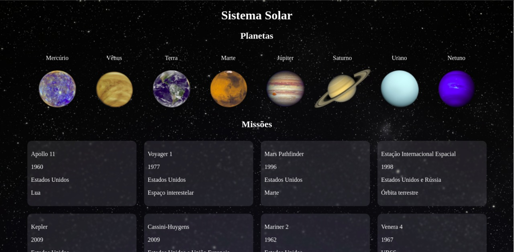

# Solar System - Enciclopédia de Missões

Esse projeto foi criado com a intenção de apresentar uma forma interativa de exibir informações sobre os planetas do sistema solar e sobre missões realizadas ao longo da história. 

## Sobre o Projeto

- [Overview](#overview)
  - [Sobre a interface](#sobre-a-interface)
  - [Screenshot](#screenshot)
  - [Links](#links)
- [Meu processo](#meu-processo)
  - [Ferramentas e linguagens](#ferramentas-e-linguagens)
  - [O que aprendi](#o-que-aprendi)
  - [Desenvolvimento continuo](#desenvolvimento-continuo)
- [Autor](#autor)


## Overview

### Sobre a interface

O usuário pode ser capaz de:

- Visualizar o layout de forma otimizada conforme a resolução da tela do dispositivo que estiver utilizando.
- Visualizar alterações visuais ao interagir com elementos da página.
- Obter informações sobre planetas e missões ao clicar no elemento desejado.

### Screenshot



### Links

- Live Site URL: [Solar System](https://solar-system-mu.vercel.app/)

## Meu processo

### Ferramentas e linguagens

- HTML5
- CSS 3
- JavaScript
- [React](https://reactjs.org/) - JS library

### O que aprendi

O projeto Solar System foi inteiramente criado aplicando o conhecimento sobre React adquirido. Como o projeto foi criado a alguns meses, o conhecimento de React e o conceito de utilizar HTML junto com Javascript pra mim ainda era muio recente então posso dizer que sinto muito orgulho das primeiras linhas de JSX que escrevi.

```JSX - Primeiro Trecho
import React, { Component } from 'react';

class Header extends Component {
  render() {
    return (
      <header>
        <h1>Sistema Solar</h1>
      </header>
    );
  }
}

export default Header;
```

```JSX - Escopo que renderiza missões
class Missions extends Component {
  render() {
    return (
      <>
        <Title headline="Missões" />
        <div data-testid="missions" className="missions">
          {missions.map(({ name, year, country, destination }) => (
            <MissionCard
              key={ name }
              name={ name }
              year={ year }
              country={ country }
              destination={ destination }
            />
          ))}
        </div>
      </>
    );
  }
}
```

### Desenvolvimento continuo

Algumas modificações planejadas para o projeto estão em andamento, entre elas estão:

- Alteração no layout permitindo a visualização de 3 planetas por vez, sendo um central em destaque.
- Ao clicar no elemento desejado, o usuário terá informações detalhadas sobre planetas e missões em um card, contendo descrições, imagens e links.

## Autor

- Website - [Gabriel Nery](https://gabrielnerys.github.io/)
- Instagram - [@gabe.nery](https://www.instagram.com/gabe.nery/)
- Twitter - [@gabenerys](https://www.twitter.com/gabenerys)
